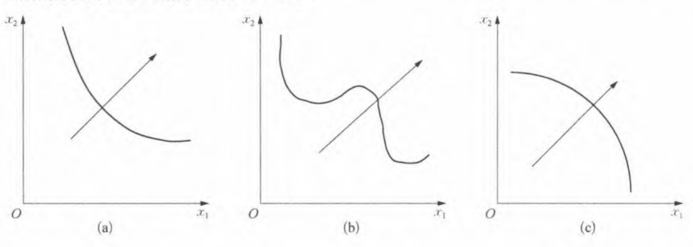
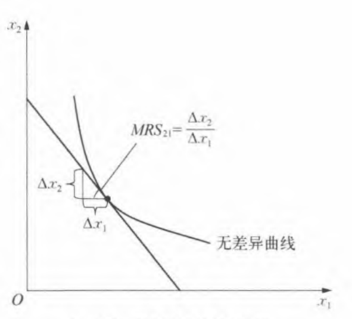
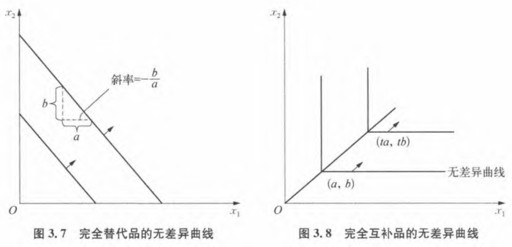
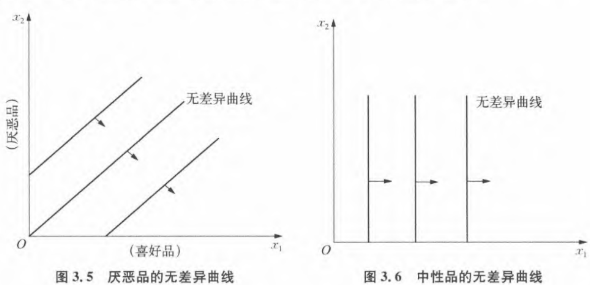
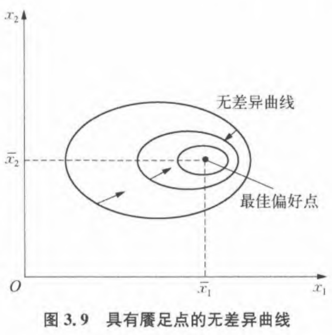

## Chapter 3: Preference
### 1. Consumer preferences
    - 1a. X is strictly preferred to Y
    - 1b. Indifferent between X and Y
    - 1C. X is Weakly preferred to Y
Utility: 主观;  
OC = $\frac{p_1}{p_2}$ 客观

#### 衡量效用：
- 基数效用  
👇
- 序数效用
  - def： 消费束$(x_1,x_2)\text{ vs }(y_1,y_2)$ （前提：理性）
    - 严格偏好：$\succ$ $\text{ e.g: }(95,95)\succ(90,90)$
    - 弱偏好：$\sim$ $\text{ e.g: }(92,92)\sim(90,90)$ 绩点计算
- 理性假设
  1) 完备性：一组消费束给你挑，总能选出来/每个点都能作比较
  2) 反身性：$(x_1,x_2)\succeq(x_1,x_2)\text{; }(x_1,x_2)\preceq(x_1,x_2)$ 自己比自己好
  3) 传递性：$(x_1,x_2)\succeq(y_1,y_2)\text{, }(y_1,y_2)\succeq(z_1,z_2)\rightarrow(x_1,x_2)\succeq(z_1,z_2)$

### 2. Assumption about preferences
    -2a. Complete
    -2b. Reflective
    -2c. Transitive

### 3. indifference curves
    - 3a. Concept: weakly preferred set （弱偏好集）
    - 3b. Properties
    - 3c. Marginal rate of substitution(MRS)
    - 3d. Marginal willingness to pay
  - def：弱偏好集的边界 -> 无差异曲线，有方向，箭头方向为更受偏好的消费束

    
    凹凸判断：两点连线在集合内为凸；所以(a)是凸的，(c)是凹的
  - prop：
    - 无差异曲线**不相交**
    - 无空心点（根据反身性）
    - 有无限条无差异曲线（完备性）
  - MRS:$\text{ }\frac{\Delta{x_2}}{\Delta{x_1}}$
    
       

    - 若$x_2$为货币量 -> MRS是保留价格or边际支付意愿 
    
### 4. Examples of Preferences
    4a. perfect substitutes
    4b. perfect complements
    4c. bads
    4d. neutrals
    4e. satiation
    4f. discrete goods
- 完全替代：总是愿意以a单位商品1交换b单位商品2，$MRS=-\frac{b}{a}$
- 完全互补：a单位商品1与b单位商品2总是同时消费

- 厌恶品，必须同时和喜好品提供才会被接受
- 中性品
- 喜好品

- 餍足：  
越接近餍足点（satiation point）越受偏好

     
### 5. Well-behaved preferences
    5a. Monotonicity
    5b. Convex
    5c. Diminishing MRS
- 良好性状偏好条件
1) 完备性
2) 反身性
3) 传递性
4) 单调性
5) 凸性$\begin{cases} 
\scriptsize 严格凸 & \text{if } \scriptsize两点连线在集合内 \\ 
\scriptsize弱凸 & \text{if }\scriptsize 两点连线可以在边界上 
\end{cases}$